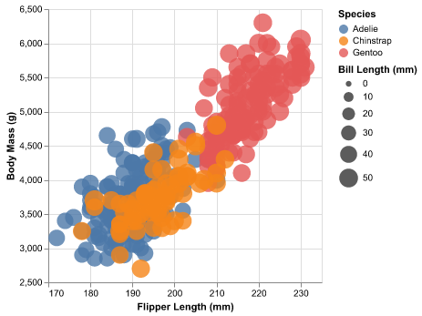
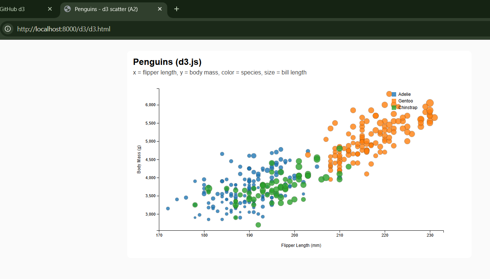
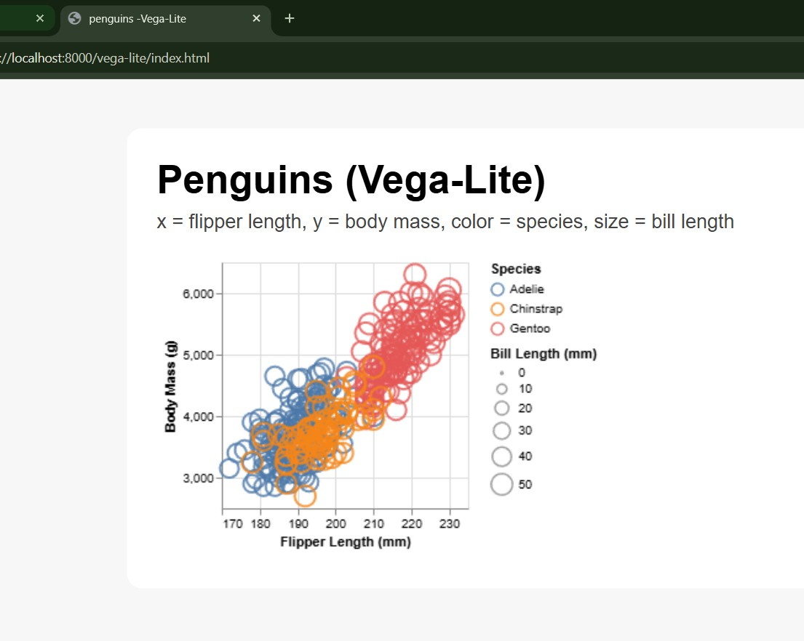
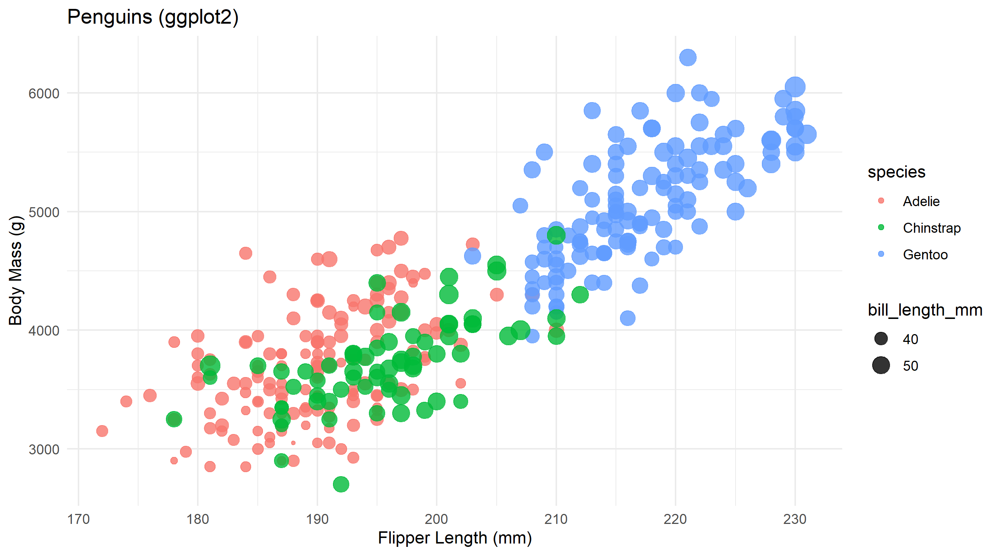

# Data Visualization in 5 Ways

For this assignment, I created the same penguin scatterplot using five different tools to see how each one handles the same data and design. The dataset is `penglings.csv` and contains measurements for penguins like flipper length, body mass, bill length, species, and island.

## The Chart

The visualization shows:
- **X-axis:** Flipper Length
- **Y-axis:** Body Mass
- **Color:** Species
- **Size:** Bill Length
- **Transparency:** Semi-transparent points to reduce overplotting

---

---

# Altair (Python)

Altair was honestly the smoothest experience. Once I loaded the data with pandas, the chart code felt very readable and intuitive. I could basically describe what I wanted (x-axis is flipper length, color is species, size is bill length) and Altair handled the rest. The biggest thing to learn was understanding how Altair expects data to be formatted, but once that clicked, everything else was easy.

I didn't have to use any hacks or weird data manipulation. Altair worked exactly as intended—I loaded the CSV, set up the encodings, and the chart rendered perfectly on the first try. This tool would be really useful for quick exploratory analysis or if I ever need clean visualizations with minimal code. I'd definitely use it again.

---

# Excel

Excel was surprisingly frustrating. Getting a basic scatterplot is easy, but the moment you want specific things like size mapping, transparency, or filtering by species, it gets annoying. I ran into a problem where filtering by species would sometimes make the chart disappear entirely, which made experimenting difficult. Excel also doesn't naturally support what I needed unless you set everything up very carefully.

The hard part was that Excel isn't designed for reproducible visual design—once I made manual adjustments, they weren't saved in a way I could easily replicate. I had to manually adjust colors and transparency, and there wasn't a clean way to map variables to visual properties like I could in code-based tools. Excel works fine for very quick, simple charts when code isn't an option, but for anything precise, it's not ideal.

---

# D3.js

D3 was very different from the other tools. Unlike Altair, D3 doesn't give you charts "for free"—I had to explicitly build everything myself, including scales, axes, and all the data-to-SVG mappings. The hardest part was making sure the visualization didn't render before the CSV finished loading. Once I figured that out, the rest became more mechanical but still required careful attention to details.

I had to do a lot of custom setup work to get colors, sizes, and opacity working the way I wanted. D3 feels extremely powerful, but also very low-level. It's great when you want full control or custom interaction, but definitely slower to use for simple charts. In the future, I'd probably only use D3 if I specifically needed interactive elements or custom animations that other tools can't do.

---

# Vega-Lite

Vega-Lite felt like a middle ground between Altair and D3. Instead of writing Python code like Altair, you write a JSON specification that describes exactly what your visualization should be. Once I figured out the exact syntax and structure, the chart rendered exactly as expected, which was really satisfying.

The challenge was that small mistakes in the JSON would cause the visualization not to render at all, so debugging felt like guesswork at times. I had to carefully set up the color schemes, scale domains, and opacity values. I didn't need to do weird data manipulation, but I did spend time making sure the JSON was perfectly formatted. I could see Vega-Lite being useful if I needed to share a standardized visualization with someone else, since the spec is clear and easy to modify.

---

# R + ggplot2

ggplot2 was powerful once I got it working, but had the steepest setup cost. Installing R packages, configuring the environment, and dealing with library paths took more time than the actual visualization code. Once everything was installed correctly, ggplot2 was very pleasant to use. The layering approach made it easy to add color, size, and transparency in a logical way.

I didn't need any weird hacks, but I did spend a lot of time on environment setup before I could even write the visualization. ggplot2 feels best suited for statistical analysis and publication-quality plots, especially if you're already working in R. If I'm doing data analysis in R anyway, I'd definitely use this. But if I'm just making one quick chart, it feels like overkill.

---

## Instructions

### To view the visualizations:

**Altair:** Run `python altair/altair_penguins.py`

**D3.js:** Open `d3/d3.html` in your browser

**Vega-Lite:** Open `vega-lite/index.html` in your browser

**ggplot2:** Run `Rscript r-ggplot/ggplot_penguins.R`

**Excel:** Open the CSV in Excel and create the chart manually

---

**Author:**  Aditya Patel
**Title:** Assignment 2 - Data Visualization in 5 Ways  
**Date:** January 30, 2026  
**Course:** CS4804
